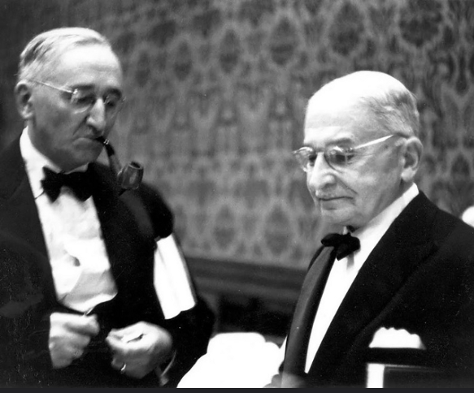
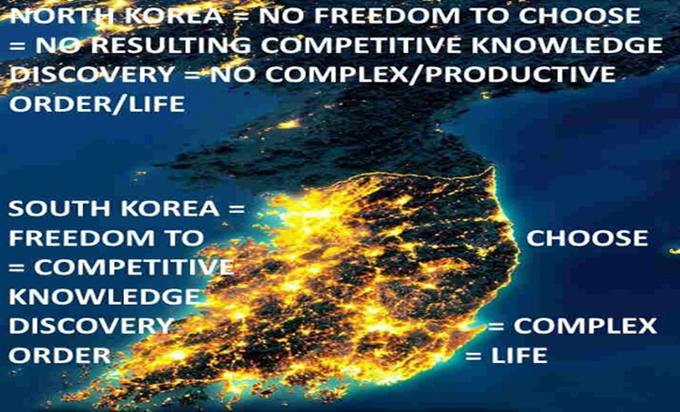
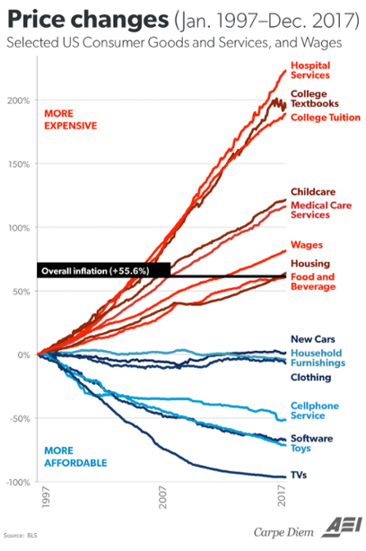
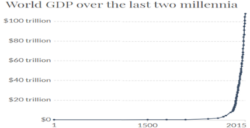

# How The World Works: A 15 Minute Introduction To The Ideas of 1974 Nobel Laureate In Economics F.A. Hayek

    
	

1974 Nobel Laureate in Economics F.A. Hayek can be considered the first person in the history of mankind to provide a complete evolutionary understanding of how the world works. Hayek is still is so far ahead of our times that even today’s leading thinkers like renowned York Times bestselling science writer Matt Ridley are, by their own admission, ‘still catching up with him’. Ridley humbly acknowledges this in a 2011 speech where he mentions:

>”As someone who came to Fredrick von Hayek comparatively late in life, I’m still catching up with him…Indeed, many of the insights I thought I had discovered in my own readings and writings on the frontier of evolutionary biology and economics it turns out Hayek had long before me…It’s Hayek who first puts it all together.” — [Matt Ridley](https://www.youtube.com/watch?v=pG-grkJPU8Q)

So how does Hayek ‘puts it all together’? Hayek realized that if one understands how information coordinates the biological and social orders then one understands how the entire world works. Let’s briefly try to get a feel for how Hayek saw the world and how dangerously lost we are without his (and friends’) wisdom.

‘Natural selection’ in general can be said to have created two mechanisms for creating two types of orders, biological and social. The biological order is created via the well-known mechanism of ‘biological evolution’ with genes being like the sentences which store the information necessary to create/coordinate life/order. Mutations cause new genes and thus new information to arise which leads to a different life-form which is then ‘naturally selected’ as it inadvertently competes with others with the winner reproducing more and thus passing on more copies of the better-adapted/”fitter” genes/information/design to future generations.

The social order, or what the great British 19th century thinker Herbert Spencer referred to as “The Social Organism”, is coordinated by what Hayek and his great mentor Ludwig von Mises referred to as ‘The Market Process’ and the “parts” it is composed of like money, prices, economic competition, interest rates, and the legal/religious/governmental frameworks that sustain it. Just like cells are unaware of how over billions of years natural selection crafted the respiratory, nervous, digestive, etc. “systems” that coordinate their actions to create multicellular life, so is mankind utterly clueless of both, how ‘The Market Process’ coordinates individuals to create ‘The Social Organism’(how the economy really works), and how it has arisen over the last 30,000 to transform solitary bands of vicious tribal slightly smarter apes into our modern global socioeconomic order. Widespread ignorance of these vital facts which were explained by Mises/Hayek/friends is what has mankind mired in tribal/political conflict, militarism, and now gripped by CovidMania.

‘The Market Process’ and resulting global socioeconomic order inadvertently emerges from the tradition of private property. Private property means that matter is under the exclusive control/ownership of a single person/mind/CPU. Each person is motivated to discover the best information with which to transform or reorder their private property in a way that increases its value or utility. Most of us transform our bodies in a manner that maximizes the value/utility of the labor we produce and then trade with other people/companies. Some transform bread and beef to increase their value as hamburgers which are then traded with others, etc. From our freedom to use/transform our private property emerges the ‘freedom to trade’ it with anyone in the entire planet which inadvertently transforms mankind into a global supercomputer where people/companies are motivated to innovate and learn from each other(competitors) thus inadvertently cooperate to discover and spread superior information and subsequent order. It is our freedom as consumers to trade our life/order-sustaining wealth for the best cars, and as producers to go into the auto-manufacturing business, which motivates existing auto manufacturers(competitors) to innovate/compete/copy/learn to produce the best cars. Companies that don’t successfully compete/innovate/copy/learn to be as productive as others won’t get enough life/order-sustaining wealth/revenue from customers to pay a competitive wage, motivating employees to once again use their freedom to trade their labor to quit and join/trade-with the increasingly better informed and thus more productive and thus higher paying companies. Just like in the Olympics we can discover the best athletes in the world due to global competition, so does having the ‘freedom to trade’ with everyone in the world allows the best ideas to compete/spread globally thus ensuring the best possible global order. Via advertising, competitors are motivated to spread the potential usefulness and superiority of their products/ideas as well as the defects/inferiority of their competitors thus accelerating the need to compete/copy/spread superior information and subsequent order. As cost-cutting ideas emerge and inevitably spread via competition leading relative prices to continuously fall, new profitable ideas easily arise and once again spread via competition in an endless cycle of knowledge generation/innovation. For example, computers were once very expensive, but once the price of making them came down enough, people easily realized that every home could have them, which gave birth to our computerized world and the Internet and all the great things that flow from it.

Morals are knowledge which also emerges and spreads via economic competition. It is hard-working, tolerant, courteous people who thanks to competition inevitably motivate everyone else to be likewise. As Hayek writes:

>“Competition is, after all, always a process in which a small number makes it necessary for larger numbers to do what they do not like, be it to work harder, to change habits, or to devote a degree of attention, continuous application, or regularity to their work which without competition would not be needed.”

Envision people coming together/apart as companies/orders emerge and dissolve in ever-changing conditions. Superior information arising and rippling/restructuring the social order thanks to competition. Each person/company/order constantly consuming/using/reordering wealth like food, energy, materials, etc. as it produces wealth in terms of labor/products/services, constantly trying to produce more wealth than it consumes thus being profitable inadvertently reordering a small section of the planet in a manner that increases the amount of wealth/life/order. As companies/orders get more productive/profitable they lure people to ‘trade-with’/‘join-them’ by offering more money/wealth for their labor, eventually causing the least productive companies/ideas to dissolve as their ‘factors of production’ like labor, buildings, etc. are bid away to be parts of more productive plans/ideas.

The role of governments and coercion should be minimized because governmental/‘public sector’ bureaucracies, being COERCIVE MONOPOLIES which get their life/order-sustaining wealth through taxes/compulsion are immune to the competitive-information-spreading incentives/pressures which motivate private sector entities to keep up with the competition in terms of information and hustle. Central/government plans can’t work if people are free to not go along with them so they inevitably require compulsion/tyranny. For example, it is a criminal act in Communist countries like North Korea and most of Cuba to start a business because it interferes with the plans of “the experts” who run the government. The image below helps explain the difference between competitive/private/free orders(South Korea) and monopolistic/government/coerced orders (North Korea). Keep your eye on how information arises/spreads via competition and continuously restructures the social order.

    

In the free/private/competitive sector information moves from the bottom (individual minds/entrepreneurs/innovators) to others/influencers/many/top as it is ‘tested’/refined/preferred by the comparisons to other information by billions of minds thus ensuring superior information spreads and is ideally adapted to each specific time and place. This mechanism is bypassed by government regulations which are top-down/coercive/competitionless/monopoly information/action which is not subject to continuous improvement/replacement via competition so they paralyze entire industries slowing down ‘competitive knowledge discovery’, driving up costs (more lawyers/regulators/bureaucrats), and potentially making criminals out of people who harm nobody but just prefer to do things differently. Hayek reminds us:

>“The argument for liberty is not an argument against organization, which is one of the most powerful tools human reason can employ, but an argument against all exclusive, privileged, monopolistic organization, against the use of coercion to prevent others from doing better.”

Compare the increasingly regulated/paralyzed healthcare sector which has grown from consuming less than 5% of the economic pie in 1960 to over 20% today, to the free/competitive IT sector where even the poorest of Americans can afford rapidly improving amazing cell phones and technology. What a person must learn in order to legally offer medical advice via licensing of doctors, where he must learn it via licensing of medical schools, what chemical compounds can be legally consumed, how to test drugs, how the medical insurance industry should work, and countless other gigantic bodies of knowledge/information are dictated by monopolistic competition-less bureaucracies like the American Medical Association (AMA), the Food And Drug Administration (FDA), CDC and numerous others. By comparison, the Information Technology sector has very few government regulations so competition motivates the discovery and spread of superior information at breakneck speed and is obviously transforming the world right before our eyes. In graph below one can see how the more regulated a sector is (Hospital Services) the more expensive/paralyzed/consumptive it becomes.

    

Given the above we can see how a sort of “swarm intelligence” emerges as the freedom of consumers to calculate and trade-with what is best nourishes the growth and spread or superior orders/companies/information, inadvertently expanding the worldwide “division of labor and information” as entire neighborhoods/cities morph themselves in specialized ways as complementary pieces of information/orders segregate themselves in distinct geographical locations like the software industry in Silicon Valley, California and manufacturing in Guangdong, southern China. As Mises reminds us “The division of labour is a fundamental principle of all forms of life.” The division of labor is a pattern/way which natural selection rediscovers to enable smaller units/orders to efficiently compartmentalize labor/information as they contribute-to (and are nourished-by) a larger organism they become parts of(Organelles -> Cells -> Organs -> Humans -> Social Organism). Mises again:

>“It is by virtue of the division of labor that man is distinguished from the animals. It is the division of labor that has made feeble man, far inferior to most animals in physical strength, the lord of the earth and the creator of the marvels of technology.”

Thus private property and emerging ‘competitive knowledge discovery’, as opposed to leading to chaos, 1) is what enables and motivates the discovery and spread of superior information which continuously increases the rate at which mankind reorders a tiny fraction of the earth’s massive volume of 260 billion cubic miles into the wealth that easily feeds/clothes/expands nearly 8 billion people, 2) civilizes us 3) protects us from being coerced into doing things we don’t want to do, or losing the wealth we have traded a part of our very lives to create or acquire, and 4) is also vital for discovering THE TRUTH!

Knowing that ‘private property’ is the simple concept/institution that leads to a chain-reaction of incentives which leads to ‘competitive knowledge discovery’ and resulting civilization, we can easily see that those tribes/orders/cultures whose customs/religions/myths inadvertently became more peaceful and thus less violent, extended peace/friendship/trade to those outside the tribe, etc., in other words, those who tended to respect ‘private property’ and thus individual freedom more and more, would inadvertently gain the benefits of superior ‘competitive knowledge discovery’, become more advanced/powerful, and as they grew, they would inadvertently spread the very customs (increasing respect for private property, tolerance, and commercial culture that emerges from it) and evolving economic system (capitalism) that allowed them to reach such relative heights.
Essentially ~30,000 years ago there was a sort of petri dish of cultures/tribes, and ‘natural selection’/competition selected those whose sort of ‘cultural mutations’ led to a more productive/fitter/powerful social order, with “respect for private property”/freedom ultimately being the most important tradition given the ‘competitive knowledge discovery’ that inadvertently emerged from it. This ‘cultural evolution’ happened mostly without the design/intention/reason of the slightly smarter apes.

An example of this process was the Protestant Reformation. For centuries the Catholic Church’s traditions/myths held immense coercive/monopoly/competitionless power which prevented/retarded individual freedom and resulting ‘competitive knowledge discovery’. In the early 1500s Martin Luther preached that a person could be saved by believing in Christ without the Catholic Church’s approval, and that the Bible itself, not the Pope/Church’s edicts/interpretations, was what mattered. This helped reduce/eliminate the coercive/monopoly power of the Church and spark a pro-freedom and thus emergent ‘competitive knowledge discovery’ that would lead to skyrocketing rates of innovation/production/prosperity per graph below.

    

Now, very important! Did Martin Luther reason that his religious interpretations would accelerate ‘competitive knowledge discovery’ leading to our relatively advanced civilization? Of course not. Just like solitary cells billions of years ago inadvertently created the respiratory/circulatory/nervous/etc. “systems” that led to multicellular organisms without ‘designing them’, so is free-market/Capitalism “indeed the result of human action, but not the execution of any human design”. The ‘free-market’/Capitalism is mankind’s greatest invention, yet it was not the result of our reason! As Hayek explains:

>“…we may owe to these religions the preservation — admittedly for false reasons — of practices that were more important in enabling man to survive in large numbers than most of what has been accomplished through reason.”

>“We have never designed our economic system. We were not intelligent enough for that. We have stumbled into it and it has carried us to unforeseen heights and given rise to ambitions which may yet lead us to destroy it.”

And regarding private property:

>“…I am quite convinced nobody invented it for a known purpose, and to me the proof of this is that even now hardly anybody yet understands what the advantages of private property and the market society are.” (Hayek essay “Individual and Collective Aims” published in “On Toleration” ISBN 0–19–827529–3)

By the late 1800s, especially after Darwin, the slightly smarter apes had realized that their moral values and laws had been grounded on religious myths, so they began replacing the naturally selected/evolved/tested wisdom/information/laws espoused by religious mythology (private property, freedom and family) which had tamed/brainwashed the savages into civilization, by the “reason” of “expert/scientist” apes. Not having the slightest clue how the vital information that orders/creates civilization “emerges” from ‘private property’/freedom since this amazing mechanisms/order had been designed, not by human reason, but by an evolutionary process we didn’t even really understand at the time, they understandably fell for all the usual anti-Capitalist and central planning fallacies. They saw economic freedom as a recipe for chaos, exploitation and ‘social injustice’. They believed that a competitionless coercive tax-funded monopoly of “experts”/ideologues/“great leaders” could better order society, and increasingly saw religion and its traditions of private property and family as something backward, unnatural, and a tool of the growing business/Capitalist/”Bourgeoisie” class, or just selfish people in general that “don’t care about others”. Just like complex environmental factors create selective pressures that favor the spread of certain genes, the environment was ripe for the emergence of a new religion/mythology, Socialism/Communism/Statism. Eventually some slightly smarter arrogant ape would describe these increasingly popular fallacies/myths in a manner that was bound to go viral and that is what happened with Karl Marx and his bite-sized ‘Communist Manifesto’:

>“the theory of the Communists may be summed up in the single sentence: Abolition of private property”….”Abolition of the family!”

The slightly smarter apes via Vladimir Lenin’s Bolshevik revolution in Russia (1918) and other apes throughout the world (Mao/China, Castro/Cuba, Pol Pot/Cambodia, etc.) with the utmost arrogance and cruelty went wild using their “reason”/“the science” and instincts to destroy the ‘competitive knowledge discovery’ the much smarter ‘cultural evolution’ had created and thus their own socioeconomic order. Hayek summarizes the inevitable result:

>“Among the founders of religions over the last two thousand years, many opposed property and the family. But the only religions that have survived are those which support property and the family. Thus the outlook for communism, which is both anti-property and anti-family(and also anti-religion), is not promising. For it is, I believe, itself a religion which had its time, and which is now declining rapidly. In communist and socialist countries we are watching how the natural selection of religious beliefs disposes of the maladapted” (Hayek F. A., 1989, p. 137)

Lenin, as well as most people today, believed that “the key feature is people, the proper choice of people”, and if we could just have the right apes/experts/Faucis/Gates/’Great Leaders’ with the right values/ideas government/‘central planning’ would work. But Lenin was wrong of course, it is not so much the individual cells/people that matter, it is the system, it is freedom and its emergent ‘competitive knowledge discovery’ and socioeconomic order spreading mechanisms.

It is important that we see Communism/’Central Planning’ and Lenin’s Bolshevik Revolution, as well as all of our socioeconomic problems since they are all caused or greatly exacerbated by competitionless-coercive-central-planning not as some ‘nefarious conspiracy’, but as an almost inevitable spread of viral self-reinforcing ‘echo chambers’ of economic fallacies and disastrous ‘incentive structures’ that were just bound to finally spark in truly sustainable reactions as the social order got more complex and thus more fertile for economic fallacies. A young idealistic Russian could worry about how to make a good living in the always-uncertain and competitive private sector, or by joining Lenin and his Socialist Bolsheviks(government) he could become a hero to mankind by just forcing farmers/‘private sector’/others to give up (share) their grain/wealth to feed a bureaucracy/monopoly of “experts” who would plan a superior order. Sign me up! We must focus on how the ideas create intellectual ‘echo chambers’ and ‘incentive structures’ that lead the slightly smarter apes into either carnage via the run-away growth of competitionless/government/coercion, or civilization. Mises:

>“It is ideas that group men into fighting factions, that press the weapons into their hands, and that determine against whom and for whom the weapons shall be used. It is they alone, and not arms, that, in the last analysis, turn the scales.”

And Hayek:

>“It is necessary to realize that the sources of many of the most harmful agents in this world are often not evil men but high-minded idealists, and that in particular the foundations of totalitarian barbarism have been laid by honourable and well-meaning scholars who never recognized the offspring they produced.” (Hayek F. A., 1973, p. 70)

>“Most people are still unwilling to face the most alarming lesson of modern history: that the greatest crimes of our time have been committed by governments that had the enthusiastic support of millions of people who were guided by moral impulses. It is simply not true that Hitler or Mussolini, Lenin or Stalin, appealed only to the worst instincts of their people: they also appealed to some of the feelings which also dominate contemporary democracies.” (Hayek F. A., 1976, p. 134)

Fortunately for mankind Ludwig von Mises nearly single-handedly put the brakes on Socialist intellectual expansion when he showed the impossibility of central planning via his essay “Economic Calculation in the Socialist Commonwealth” and persuaded Austrian politicians away from Communism in the early 1920s when the Bolshevik/Socialist revolution was rapidly expanding thus helping stop the falling dominoes in Europe:

>“There were few who recognized the state of affairs clearly. People were so convinced of the inevitability of Bolshevism that their main concern was securing a favorable place for themselves in the new order. The Catholic Church and its followers, the Christian Social Party, were prepared to befriend the Bolshevists with the same eagerness with which the bishops and archbishops would embrace National Socialism 20 years later.…I knew what was at stake. Bolshevism would lead Vienna to starvation and terror within a few days. Plundering hordes would take to the streets and a second blood bath would destroy what was left of Viennese culture.”.. “The most important task I undertook…was the forestalling of a Bolshevist takeover… The fact that events did not lead to such a regime in Vienna was my success and mine alone.” [–Mises (Memoirs)](https://mises.org/library/education-austro-marxist)

Later Hayek’s classic book “The Road to Serfdom”(1944), but perhaps more importantly, the brilliantly written ‘condensed’ version which “Reader’s Digest” magazine placed in millions of US homes in 1945, would play a vital role in educating future freemarketeers like future British PM Margaret Thatcher, and 3-time presidential candidate Dr. Ron Paul who writes:

>“My introduction to Austrian economics came when I was studying medicine at Duke University and came across a copy of Hayek’s The Road to Serfdom. After devouring this, I was determined to read whatever I could find on what I thought was this new school of economic thought — especially the works of Mises”

Standing on Mises’ shoulders who provided him a superb understanding of the economy/Matrix and oh so much more, Hayek showed us how the Matrix evolved, not just independent of our reason, but in spite of our reason which constantly fights via ‘coercive central planning’ the very freedom and resulting ‘competitive knowledge discovery’ which gives us life. Armed with their wisdom we can easily see how the slightly smarter apes keep self-mutilating with coercive central planning. The relatively successful apes like Bill Gates, politicians, and World Economic Forum’s Klaus Schwab who find themselves in positions of “leadership” understandably believe that they are the best suited to come up with global central plans which will inadvertently destroy the ‘competitive knowledge discovery’ needed to really improve society. These slightly smarter apes, are neither “evil” (a mythical term), not stupid, they are just your average ‘uncivilized slightly smarter ape’ who simply lacks a real understanding of economics needed to act in a way that leads to civilization and thus be a ‘civilized slightly smarter ape’. They are like powerful/successful Bishops or Senators during the Spanish Inquisition and Roman Empire. Relatively successful/powerful with the adoration of many apes, but just as totally clueless regarding how the world really works. Mises easily predicted their personalities and inevitable totalitarian aims:

>“The outstanding fact about the contemporary ideological situation is that the most popular political doctrines aim at totalitarianism, the thorough abolition of the individual’s freedom to choose and to act. No less remarkable is the fact that the most bigoted advocates of such a system of conformity call themselves scientists, logicians, and philosophers.”

Thus Mises provides the cure to our central planning created troubles:

>“Economics must not be relegated to classrooms and statistical offices and must not be left to esoteric circles. It is the philosophy of human life and action and concerns everybody and everything. It is the pith of civilization and of man’s human existence…All present-day political issues concern problems commonly called economic. All arguments advanced in contemporary discussion of social and public affairs deal with fundamental matters of…economics. Everybody’s mind is preoccupied with economic doctrines…Everybody thinks of economics whether he is aware of it or not. In joining a political party and in casting his ballot, the citizen implicitly takes a stand upon essential economic theories…As conditions are today, nothing can be more important to every intelligent man than economics. His own fate and that of his progeny is at stake…all reasonable men are called upon to familiarize themselves with the teachings of economics. This is, in our age, the primary civic duty. Whether we like it or not, it is a fact that economics cannot remain an esoteric branch of knowledge accessible only to small groups of scholars and specialists. Economics deals with society’s fundamental problems; it concerns everyone and belongs to all. It is the main and proper study of every citizen.”

>“Everyone carries a part of society on his shoulders; no one is relieved of his share of responsibility by others. And no one can find a safe way out for himself if society is sweeping towards destruction. Therefore, everyone, in his own interests, must thrust himself vigorously into the intellectual battle. None can stand aside with unconcern; the interests of everyone hang on the result. Whether he chooses or not, every man is drawn into the great historical struggle, the decisive battle into which our epoch has plunged us.”